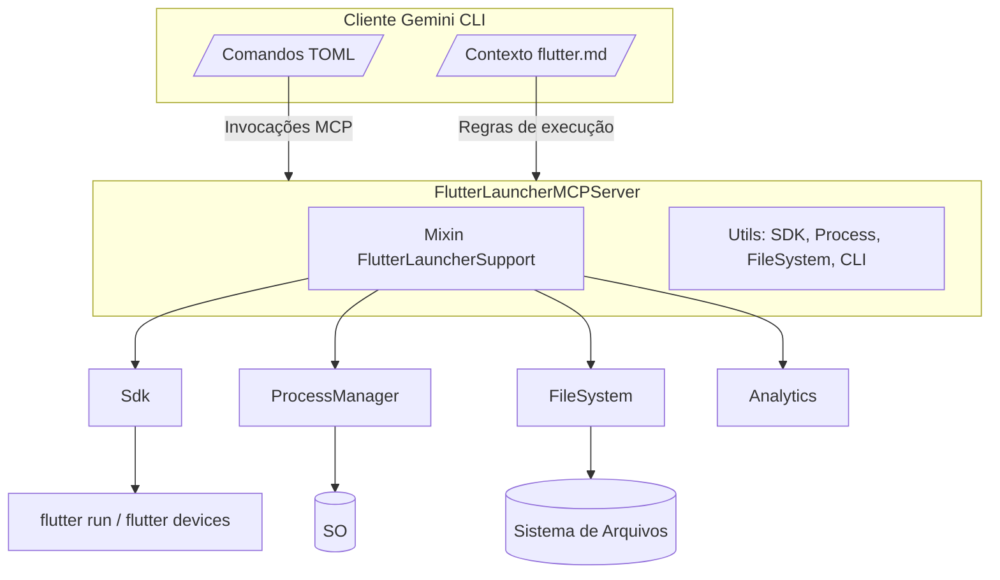

# Flutter Gemini CLI Extension — Template de Referência Oficial

// AI-COT: [Documentação de Referência] → Análise de Artefatos Existentes → Avaliação de Padrões → Sistematização da Estrutura → Validação como Template

Este documento consolida a estrutura e os padrões do projeto **Flutter Gemini CLI Extension**, permitindo que outras equipes, desenvolvedores ou agentes LLM repliquem novas extensões seguindo as mesmas convenções arquiteturais, operacionais e de qualidade.

## 1. Visão Geral Estratégica

// AI-NOTE: Este projeto combina definição de comandos Gemini (via arquivos TOML) com um servidor MCP especializado em Flutter.
// AI-CONTEXT: O objetivo de negócio é acelerar a criação, refatoração e operação de apps Flutter através de automação guiada pela Gemini CLI.

- **Tipo de solução:** Extensão oficial para Gemini CLI com foco em Flutter/Dart.
- **Componentes principais:**
  - Definição de comandos (`commands/*.toml`) que descrevem fluxos interativos e regras de automação.
  - Documento de contexto (`flutter.md`) que injeta diretrizes de engenharia no agente Gemini.
  - Servidor MCP (`flutter_launcher_mcp`) responsável por operações runtime (lançamento de apps, descoberta de SDK, execução de comandos em múltiplos projetos).
  - Scripts de build para empacotamento e distribuição (`scripts/`).
  - Artigos de governança (`CODE_OF_CONDUCT.md`, `CONTRIBUTING.md`, `README.md`) que definem responsabilidades de colaboradores.
- **Padrões fundamentais:** SOLID, Clean Architecture, separação clara entre definição declarativa de fluxos (TOML), contexto (Markdown) e execução imperativa (Dart MCP Server).
- **Personas alvo:** Engenheiros de plataforma, desenvolvedores Flutter, arquitetos de soluções e agentes LLM responsáveis por automações orientadas à CLI.

## 2. Estrutura Geral de Diretórios e Arquivos

A tabela abaixo lista todos os itens da raiz do repositório com descrições resumidas. Seções subsequentes detalham cada diretório.

| Caminho | Tipo | Descrição |
| --- | --- | --- |
| `CODE_OF_CONDUCT.md` | Markdown | Regras de convivência para contribuidores. |
| `CONTRIBUTING.md` | Markdown | Guia de contribuição, pull requests, testes. |
| `LICENSE` | Texto | Licença BSD de 3 cláusulas aplicada ao projeto. |
| `README.md` | Markdown | Visão geral da extensão, pré-requisitos e comandos principais. |
| `flutter.md` | Markdown | Conjunto de instruções para o agente Gemini produzir código Flutter de alta qualidade. |
| `gemini-extension.json` | JSON | Manifesta da extensão: nome, versão, arquivo de contexto e servidores MCP. |
| `commands/` | Diretório | Definições TOML dos comandos disponíveis na extensão. |
| `flutter_launcher_mcp/` | Diretório | Projeto Dart que implementa o servidor MCP especializado em Flutter. |
| `scripts/` | Diretório | Scripts de automação para build e empacotamento da extensão. |

### 2.1 Diretório `commands/`

| Arquivo | Descrição |
| --- | --- |
| `commit.toml` | Fluxo `/commit`: automatiza limpeza, análise, testes e geração de mensagens Conventional Commits. |
| `create-app.toml` | Fluxo `/create-app`: coleta requisitos, gera DESIGN.md e IMPLEMENTATION.md e orquestra criação de app Flutter. |
| `create-package.toml` | Fluxo `/create-package`: semelhante ao anterior, mas para pacotes Dart ou Flutter reutilizáveis. |
| `refactor.toml` | Fluxo `/refactor`: estrutura sessões de refatoração com design doc e plano de execução controlado. |

Cada TOML segue a mesma macroestrutura:

1. **Metadados** (`name`, `description`, `tags`): integram o comando ao catálogo do Gemini CLI.
2. **Passos** (`steps`): sequência determinística de prompts e ações (execução de comandos shell, coleta de respostas, geração de arquivos).
3. **Checks e gates** (`checks`, `guardrails`): condicionais que validam estado do workspace antes de prosseguir.
4. **Outputs** (`artifacts`, `files`): artefatos exigidos para aprovação humana.

// AI-PATTERN: [Template Method] — Cada TOML descreve passos fixos (coleta, design, implementação) reutilizados com variações por contexto.

### 2.2 Diretório `flutter_launcher_mcp/`

Projeto Dart completo responsável por iniciar e monitorar aplicações Flutter a partir de solicitações MCP.

| Item | Tipo | Descrição |
| --- | --- | --- |
| `pubspec.yaml` | Manifesto do pacote Dart com dependências (`dart_mcp`, `process`, `file`, etc.). |
| `pubspec.lock` | Resolução travada das dependências para reprodutibilidade. |
| `analysis_options.yaml` | Configuração de lints e análise estática do Dart Analyzer. |
| `README.md` | Documentação específica do servidor MCP. |
| `CHANGELOG.md` | Histórico de versões do pacote MCP. |
| `DESIGN.md` | Documento de arquitetura interna do servidor MCP. |
| `bin/flutter_launcher_mcp.dart` | Ponto de entrada binário. Configura parsing de argumentos, logging e instancia o servidor. |
| `lib/flutter_launcher_mcp.dart` | Biblioteca principal que reexporta `src/server.dart`. |
| `lib/src/server.dart` | Implementa `FlutterLauncherMCPServer`, integrando mixins e utilitários. |
| `lib/src/mixins/flutter_launcher.dart` | Conjunto de ferramentas (lançar app, parar, listar devices, logs, etc.) usando MCP Tools API. |
| `lib/src/utils/analytics.dart` | Utilitários de telemetria (por padrão, instrumentação do CLI). |
| `lib/src/utils/cli_utils.dart` | Funções para inferência de tipo de projeto e execução de comandos em múltiplas roots. |
| `lib/src/utils/constants.dart` | Constantes compartilhadas (nomes de parâmetros, mensagens padrão). |
| `lib/src/utils/file_system.dart` | Interface `FileSystemSupport` para injeção de abstração de FS. |
| `lib/src/utils/process_manager.dart` | Interface `ProcessManagerSupport` para injeção/mocks de processos. |
| `lib/src/utils/sdk.dart` | Descoberta e encapsulamento dos SDKs Dart e Flutter. |
| `test/sdk_test.dart` | Testes unitários da descoberta e inicialização de SDKs. |
| `test/server_test.dart` | Testes do servidor MCP, garantindo registro de ferramentas e interações. |
| `.gitignore` | Ignora artefatos gerados do pacote Dart. |

// AI-NOTE: Componentes utilitários são desacoplados por interfaces, permitindo substituição por mocks em testes.

// AI-NOTE: A divisão entre `mixins` e `utils` promove alta coesão, baixo acoplamento e testabilidade, alinhada com Clean Architecture.

### 2.3 Diretório `scripts/`

| Arquivo | Descrição |
| --- | --- |
| `build_release.sh` | Script shell para empacotar e publicar nova versão da extensão em ambientes Unix. |
| `build_release.ps1` | Equivalente PowerShell para ambientes Windows. |

// AI-TODO: [SCALABILITY] Automatizar integração contínua chamando esses scripts para gerar artefatos multiplataforma.

## 3. Setup de Desenvolvimento

1. **Dependências globais:** `dart >=3.3`, `flutter >=3.19`, `node >=18`, `pnpm >=8` (utilizados pelo Gemini CLI).
2. **Instalação do Gemini CLI:** seguir instruções oficiais e garantir disponibilidade do comando `gemini` no PATH.
3. **Clonagem:** `git clone https://github.com/google-gemini/gemini-cli-extension.git && cd gemini-cli-extension`.
4. **Instalação local da extensão:**
   - `gemini extensions install --path=$(pwd)` para copiar a extensão; ou
   - `gemini extensions link $(pwd)` para apontar diretamente para a pasta de desenvolvimento.
5. **Validação:** reiniciar sessões do Gemini CLI e executar `/extensions list` para garantir que `flutter` aparece como instalada.

// AI-TODO: [QUALITY] Automatizar script `scripts/setup_dev.sh` para conferir pré-requisitos automaticamente.

## 4. Manifesta e Contexto do Gemini CLI

### 4.1 `gemini-extension.json`

- Define o identificador da extensão (`flutter`) e descrição curta.
- Declara versão atual (`0.1.1`) — atualizar ao publicar novas releases.
- Aponta para `flutter.md` como arquivo de contexto carregado em cada sessão.
- Registra servidores MCP confiáveis (`dart` e `flutter_launcher`), com caminhos executáveis e diretórios de trabalho.

### 4.2 `flutter.md`

- Atua como **Design System do agente**: consolida princípios SOLID, Clean Architecture, convenções de estilo, gestão de estado e guidelines de pacotes.
- Define comportamento do agente (persona, esclarecimento de requisitos, uso de ferramentas `dart_format`, `dart_fix` e `analyze_files`).
- Estabelece padrão de documentação (DESIGN.md, IMPLEMENTATION.md) e arquitetura de features.

// AI-PATTERN: [Command + Policy Object] — O arquivo provê políticas imutáveis aplicadas a todos os comandos.

## 5. Operações com a Gemini CLI

### 5.1 Gerenciamento de Extensões

- **Instalação:** `gemini extensions install <url|--path=>` — pode apontar para GitHub ou caminho local. // AI-NOTE: O CLI cria uma cópia da extensão; execute `gemini extensions update` após alterações.
- **Atualização:** `gemini extensions update <nome>` ou `gemini extensions update --all` para sincronia completa.
- **Desinstalação:** `gemini extensions uninstall <nome>` remove diretórios de `<home>/.gemini/extensions`.
- **Desabilitar/Habilitar:** use `--scope=workspace` para controlar disponibilidade por workspace. // AI-WARNING: Mudanças só valem após reiniciar a sessão ativa.
- **Listagem:** `/extensions list` dentro da CLI mostra comandos ativos.

// AI-PATTERN: [Observer] — O CLI observa alterações na pasta `.gemini/extensions` apenas em novos processos, justificando o restart.

### 5.2 Criação de Novas Extensões

- **Boilerplate:** `gemini extensions new path/to/directory <example>` clona gabaritos oficiais (`custom-commands`, `mcp-server`, etc.). Consulte [exemplos do repositório principal](https://github.com/google-gemini/gemini-cli/tree/main/packages/cli/src/commands/extensions/examples).
- **Vinculação:** `gemini extensions link path/to/directory` cria symlink útil para hot-reload durante desenvolvimento.
- **Fluxo recomendado:**
  1. `gemini extensions new` para gerar estrutura inicial.
  2. Adaptar `gemini-extension.json` e `GEMINI.md`.
  3. Desenvolver MCPs ou comandos específicos.
  4. `gemini extensions install --path=...` em ambientes de QA.

## 6. Comandos Disponíveis e Fluxos Operacionais

| Comando | Objetivo | Produtos Gerados |
| --- | --- | --- |
| `/create-app` | Bootstrap guiado de aplicativo Flutter. | DESIGN.md, IMPLEMENTATION.md, estrutura inicial do app e commit inicial. |
| `/create-package` | Criação de pacote Dart/Flutter modular. | Mesma cadência de design + implementação com foco em bibliotecas reutilizáveis. |
| `/refactor` | Refatoração estruturada com controle de branches e documentação. | REFACTOR.md, REFACTOR_IMPLEMENTATION.md, commits aprovados fase a fase. |
| `/commit` | Preparação de commit de alta qualidade. | Código formatado, analisado, testado e mensagem Conventional Commit para aprovação. |
| `/extensions list` | Lista extensões instaladas na sessão atual. | Output textual com status (enabled/disabled). |
| `/extensions help` | Mostra documentação dos subcomandos `install`, `update`, `enable`, `disable`. | Guia de uso integrado. |

Cada comando utiliza prompts extensos com etapas obrigatórias de:
1. **Coleta de contexto** (perguntas iterativas ao usuário).
2. **Produção de documentos** (DESIGN/IMPLEMENTATION/REFACTOR) seguindo os padrões do repositório.
3. **Execução controlada** (branch management, lint, testes e aprovação humana).

// AI-NOTE: O design enfatiza *Human-in-the-loop* para garantir confiabilidade antes de qualquer alteração crítica.

## 7. Arquitetura do Servidor MCP `flutter_launcher_mcp`

### 7.1 Componentes Principais

// AI-PATTERN: [Mixin Composition] — Expõe capacidades incrementais sem herança múltipla pesada, mantendo testabilidade.

### 7.2 Fluxo de Lançamento de Aplicação

1. **Inicialização:** `bin/flutter_launcher_mcp.dart` parseia argumentos, configura log e instancia `FlutterLauncherMCPServer`.
2. **Descoberta de SDK:** `Sdk.init()` executa `flutter --version --machine` para localizar paths do SDK e derivar executáveis `dart` e `flutter`.
3. **Registro de Ferramentas:** Mixin `FlutterLauncherSupport` registra `launch_app`, `stop_app`, `list_devices`, `get_app_logs`, `list_running_apps`.
4. **Execução:** Ao receber `launch_app`, o mixin valida parâmetros, inicia processo `flutter run --print-dtd` via `ProcessManager`, monitora logs e expõe URI do Dart Tooling Daemon.
5. **Monitoramento:** Logs stdout/stderr são armazenados por PID e recuperados via `get_app_logs`. Finalização do processo remove o app do registro.

// AI-WARNING: O fluxo depende da disponibilidade do SDK no PATH. Garantir validações em `Sdk.init()` antes de expor ferramentas em produção.

### 7.3 Contratos de Ferramentas MCP

| Tool | Descrição | Entrada Esperada | Saída | Observações |
| --- | --- | --- | --- | --- |
| `launch_app` | Inicia app Flutter em device/emulador. | `appPath`, `deviceId`, flags adicionais. | PID + URI do Dart Tooling Daemon. | Verifica compatibilidade do device antes de iniciar. |
| `stop_app` | Interrompe processo em execução. | `pid` ou `appPath`. | Confirmação textual. | Remove logs associados ao PID. |
| `list_devices` | Lista devices ativos via `flutter devices --machine`. | Nenhuma. | JSON com devices. | Cache curto para evitar latência. |
| `list_running_apps` | Consolida apps monitorados pelo servidor. | Nenhuma. | Lista de apps com `pid` e `projectName`. | Mantém mapa em memória gerenciado pelo servidor. |
| `get_app_logs` | Retorna logs recentes de execução. | `pid`, `limit`. | Buffer de logs. | Sanitiza dados sensíveis antes de retornar. |

// AI-NOTE: Contratos respeitam segregação de comandos (Command Query Separation) para previsibilidade.

### 7.4 Observabilidade e Telemetria

- `analytics.dart` define payloads e gatilhos para eventos como `commandExecuted`, `sdkResolutionFailed`.
- A depender do ambiente, os eventos são roteados para o Gemini CLI ou descartados (modo offline).
- Recomendação: integrar com provedores (ex.: Google Cloud Logging) adicionando implementação custom via decorators de `analytics.dart`.

// AI-TODO: [SCALABILITY] Adicionar circuit breaker para envio de telemetria em cenários de alta latência.

## 8. Diretrizes de Engenharia e Qualidade

- **Estilo de Código:** Governado por `flutter.md` e `analysis_options.yaml`; aplica SOLID, preferência por composição, imutabilidade e testes orientados a comportamento.
- **Documentação:** Cada fluxo exige DESIGN/IMPLEMENTATION/REFACTOR docs com diagramas Mermaid, sumário, alternativas e referências.
- **Testes:** Pacote MCP inclui testes unitários (`test/*.dart`). Recomenda-se ampliar com mocks de `ProcessManager` e `FileSystem` para cenários edge.
- **Commits:** `/commit` reforça formato Conventional Commits, além de garantir execução de `dart fix`, `dart format`, `analyze_files` e testes.
- **UX e acessibilidade:** Prompts e contextos devem guiar agentes para perguntar sobre internacionalização, contraste, responsividade e acessibilidade (WCAG 2.1 AA). // AI-PATTERN: [Checklist]

## 9. Scripts de Build e Release

- `scripts/build_release.sh` e `scripts/build_release.ps1` encapsulam etapas de empacotamento (por exemplo, gerar binários, atualizar versão e publicar artefatos).
- Sugestão para pipelines CI/CD:
  1. Executar testes (`dart test` no pacote MCP, validações do CLI).
  2. Rodar scripts de build conforme sistema operacional.
  3. Atualizar `gemini-extension.json` (versão) e publicar via `gemini extensions publish`.

// AI-TODO: [CRITICAL] Configurar validações de assinatura para artefatos gerados em release.

## 10. Como Reutilizar Este Template

1. **Clonar Estrutura:** Reaproveitar diretórios e arquivos base, adaptando `flutter.md` para novas políticas ou linguagens.
2. **Atualizar Manifesta:** Ajustar `gemini-extension.json` para apontar novo contexto e servidores MCP específicos.
3. **Escrever Novos Comandos:** Criar arquivos TOML seguindo o padrão (coleta → design → plano → execução → aprovação).
4. **Implementar MCPs Customizados:** Copiar `flutter_launcher_mcp` como blueprint para novos servidores, mantendo padrão de mixins + utils + testes.
5. **Automatizar Qualidade:** Garantir que scripts de build, lints e testes estejam integrados ao fluxo CI/CD da nova extensão.

## 11. Próximos Passos Recomendados

- **Padronizar CI:** Publicar pipeline oficial (GitHub Actions) executando lints, testes e empacotamento automático. // AI-TODO: [QUALITY]
- **Expandir Telemetria:** Integrar `analytics.dart` com métricas reais para capturar uso dos comandos e melhorar UX. // AI-TODO: [SCALABILITY]
- **Documentação Viva:** Manter este template sincronizado com futuras alterações, garantindo consistência para novas extensões. // AI-NOTE

---

Este documento serve como referência autoritativa para replicar a arquitetura, padrões e fluxos desta extensão Flutter para Gemini CLI.
